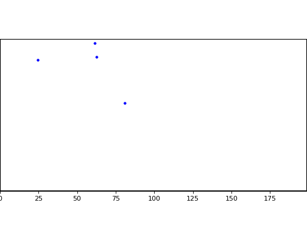

# N-Body-Simulator
This repository contains the code for an OpenMP based simulator for the n-body problem.

## Running the simulator
```
g++ -fopenmp manybody-sim-program.cpp
./a.out
```

## Running the visualizer
```
python visualizer.py
```
or 
```
python plot_gif.py
```

## Result
These results have been generated for 4 bodies for 5000 time steps with each time step spanning 0.1s.

